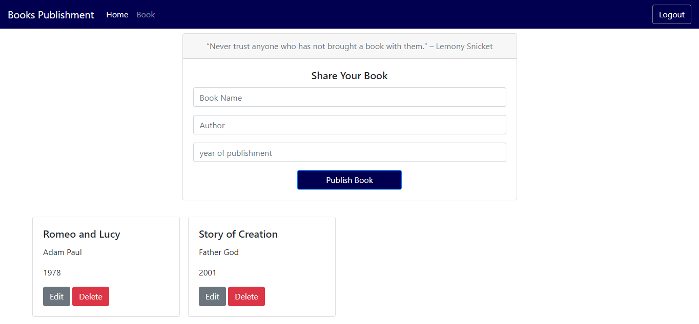

# Books-sales

# Books Publishment Application [Solo project]

> This project consists of building an application where an individual is able to publish his of her book to the general public, with options of deleting and updating. 

The purpose of this project is to  the develop a books Publishment app.

## Built With

- HTML,
- CSS,
- JavaScript

## Getting Started

To get a local copy up and running follow these simple example steps.

### Prerequisites

#### You should have installed git on your local machine and a text editor preferably VS Code.

### Setup

#### Clone the repository into your local machine.

## Author

👤 **Author**

- Github: [@OdongAlican](https://github.com/OdongAlican)
- Twitter: [@odongsandie](https://twitter.com/odongsandie)
- Linkedin: [Sunday Alican odong](https://www.linkedin.com/in/sunday-alican-odong-b99226b7)

Contributions, issues and feature requests are welcome!

Feel free to check the [issues page](issues/).

## Show your support

Give a ⭐️ if you like this project!

## Acknowledgments

- Appreciation to my coding Partner and mentor

## 📝 License

This project is [MIT](lic.url) licensed.

